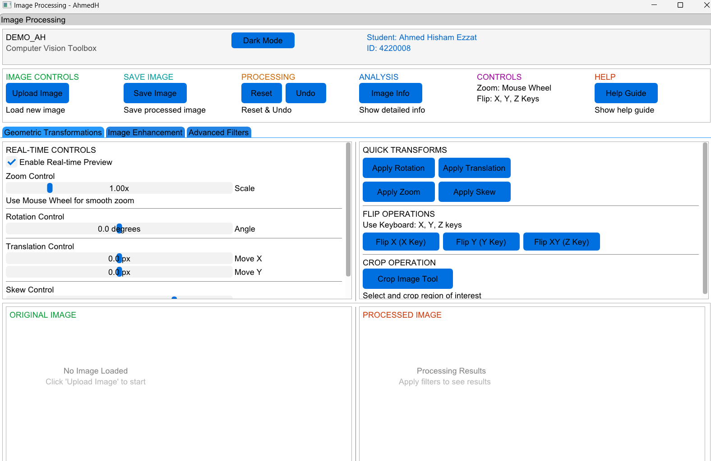

# Toolbox – Image Processing 

A desktop tool for cleaning noisy images and enhancing quality using advanced filters.

**Features:**
- Remove noise from low-quality images
- Apply advanced filters for clearer output
- Interactive GUI using ImGui
- File selection dialogs with TinyFileDialogs
- Real-time image preview using OpenCV and GLUT

**Technologies:** C++, OpenCV, GLUT, ImGui, TinyFileDialogs

**Note:** Try it yourself to discover all the advanced filters and effects! 😎

